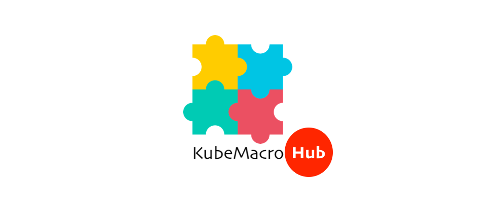

# KubeMacro Hub: The Awesome Kube Macros

---

## About KubeMacro and KubeMacro Hub

?> `KubeMacro` is designed as a kubectl plugin to run kube macro (macro for short) that wraps a set of kubectl calls or Kubernetes API calls into one command that you can run from the command line as many times as you want. To learn more on KubeMacro, please read its [online documentation](https://morningspace.github.io/kubemacro/docs/).

?> `KubeMacro Hub` is a central place for people to exchange their awesome kube macros across the Kubernetes community. You can explore the amazing macros created by other people, or share your own cool macros to other people via KubeMacro Hub. To learn more on KubeMacro Hub, please read [Using KubeMacro Hub](https://morningspace.github.io/kubemacro/docs/#/using-kubemacro-hub) from KubeMacro online documentation, where you will learn how to explore and install macros hosted on KubeMacro Hub.

## Welcome Contributions

?> To write a `macro` is easy. It is essentially a set of kubectl calls or Kubernetes API calls wrapped as a shell function. To learn more on how to write a macro, please read [Wrting a Macro](https://morningspace.github.io/kubemacro/docs/#/writing-a-macro.md). If you have a fancy macro, don't hesitate to share with other people from the community by contributing your macro to KubeMacro Hub. Just submit a pull request to the [GitHub repository](http://github.com/morningspace/kubemacro-hub) of KubeMacro Hub. When it passes review and gets merged, your macro will be available right immediately on [KubeMacro Hub](https://morningspace.github.io/kubemacro-hub/). To learn more on how to contribute to KubeMacro Hub, please read the [Contributing](https://morningspace.github.io/kubemacro/docs/#/contributing.md) guidance.
